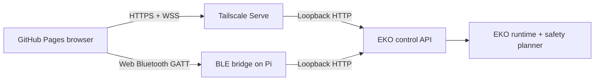

# EKO Remote v0.3.4 architecture

## Deployable parts



The browser is an operator client. The EKO runtime is authoritative for state, hardware, AI, persistence, and safety. The BLE bridge translates a framed GATT protocol into the same loopback HTTP API used by Wi-Fi, so transport choice does not create a second behavior implementation.

## Source map

| Path | Responsibility |
| --- | --- |
| `src/transports/Transport.ts` | Transport-neutral request, telemetry, disconnect, and emergency-stop contract |
| `src/transports/WifiTransport.ts` | HTTPS endpoints, WSS telemetry, bearer/subprotocol authentication |
| `src/transports/BleTransport.ts` | Web Bluetooth discovery, GATT connection, serialized writes, response matching |
| `src/transports/bleProtocol.ts` | Binary framing, fragmentation, validation, and reassembly |
| `src/client.ts` | Typed EKO operations independent of the active transport |
| `src/hooks/useEkoConnection.ts` | React connection lifecycle, status, events, polling, saved profile |
| `src/components/` | Shared shell, connection dialog, panels, metrics, and toggles |
| `src/pages/` | Dashboard, drive, AI/capability gates/temp-history, vision, memory, logs, typed config, and settings views |
| `src/components/WifiProfilesEditor.tsx` | Structured SSID, write-only password, and priority editor |
| `bridge/eko_ble_bridge.py` | BLE GATT peripheral and loopback API adapter |
| `bridge/api_client.py` | Dependency-free mapping from semantic operations to EKO HTTP routes |
| `bridge/protocol.py` | Python implementation of the BLE framing contract |
| `.github/workflows/` | Test, static build, and GitHub Pages deployment |

## Request flow

Every page calls `EkoClient`. The client chooses a semantic operation such as `drive`, `message`, or `vision.snapshot` and sends it through the active `EkoTransport`.

```mermaid
sequenceDiagram
    participant Page
    participant Client as EkoClient
    participant Link as Wi-Fi or BLE
    participant Pi as EKO API

    Page->>Client: semantic operation
    Client->>Link: request(operation, payload)
    Link->>Pi: HTTPS route or BLE bridge
    Pi-->>Link: typed result
    Link-->>Client: response
    Client-->>Page: data or error
```

## Motion safety

The drive page sends normalized `vx`, `vy`, and `wz` vectors while input is held. Wi-Fi repeats every 250 ms; BLE repeats every 320 ms. Both are shorter than EKO's 750 ms dead-man interval.

Safety layers:

1. The page sends an explicit zero vector on release.
2. Disconnect attempts emergency stop before closing the transport.
3. BLE has a dedicated stop characteristic that bypasses normal request framing.
4. The planner rejects movement when hardware is disabled or mode is stationary.
5. The robot-side watchdog stops motion when repeated commands cease.

Only layers four and five are authoritative; browser behavior is additional defense.

## Credentials

Wi-Fi and BLE use separate optional tokens. They are never Vite environment variables or bundle constants. When automatic reconnect is disabled, credentials are not written to local storage. The BLE bridge uses the API token only for its loopback HTTP calls and separately validates the BLE application token.

## Configuration and storage telemetry

`config.list` returns fixed typed fields, constraints, and per-field restart metadata from EKO's
authenticated API. It never returns raw YAML or expanded `.env` values. `config.update` accepts
only value changes for existing dotted paths. The Config page renders type-appropriate controls,
including every boolean switch. Settings intentionally does not duplicate them. The operator
receives a restart prompt only when the server marks a changed field startup-managed.

`wifi.profiles` is deliberately separate from `config.list`: profile rows are not arbitrary YAML.
The editor can add, reorder by numeric priority, remove, replace, or explicitly clear passwords.
A blank password field preserves a saved password; responses expose only `password_set`. The UI
therefore never holds a previously saved Wi-Fi password and labels changes for the next boot or
recovery run rather than claiming they applied to the current connection.

## Temporary CHAT context

The AI page reads `chat.history` metadata and shows exact-exchange count, summary word count, and
the total CHAT exchanges handled during this robot process. `chat.forget` clears that user's
RAM-only context and resets the browser transcript while leaving durable SQLite MEMORY untouched.
Neither endpoint returns temporary transcript text. Both Wi-Fi and BLE map to the same EKO API.

Memory records keep stable backend IDs for delete requests, but the API also returns a dynamic
`display_index`. The UI reloads after deletion so visible numbering always becomes 1…N.

Dashboard storage values come from `state.health`. EKO samples filesystem used/total capacity no
more than once per minute; faster Wi-Fi/BLE telemetry frames reuse that sample.

## Expensive capability gates

The AI sidebar has three live gates backed by the ordinary settings route:

| Gate | Robot setting | UI status |
| --- | --- | --- |
| Web search | `web_search_enabled` | Enabled/disabled |
| Camera questions | `camera_on_demand` | Configured state, remaining quota, and cooldown |
| Song listening | `song_enabled` | Dependency state, remaining quota, and cooldown |

The browser gate is a convenience and privacy control. The robot service checks the same setting
again before capture, then enforces its own in-process sliding quota. Disabling or closing the page
cannot bypass robot-side validation. Camera and song requests use the longer message timeout on
both Wi-Fi and BLE because physical capture plus two cloud calls can exceed a normal JSON request.

## Operation mapping

| Semantic operation | Wi-Fi route | BLE bridge route |
| --- | --- | --- |
| `message` | `POST /message` | `POST /message` |
| `settings.update` | `POST /settings` | `POST /settings` |
| `wifi.profiles` | `GET /wifi/profiles` | `GET /wifi/profiles` |
| `wifi.profiles.update` | `POST /wifi/profiles` | `POST /wifi/profiles` |
| `vision.snapshot` | `POST /vision/snapshot` | `POST /vision/snapshot` |
| `chat.forget` | `DELETE /chat/history` | `DELETE /chat/history` |

## Bandwidth

Wi-Fi is preferred for images and dense logs. BLE supports arbitrary JSON sizes through fragmentation, but the bridge serializes notifications and intentionally spaces frames to improve reliability. Status/events are compact and sent once per second.
