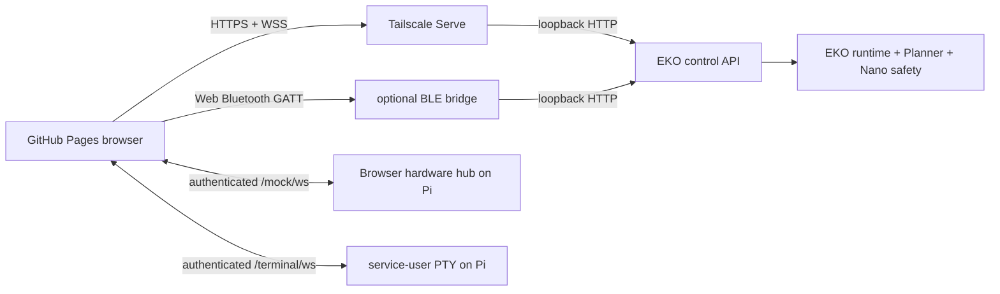

# EKO Remote v0.4.1 architecture

This is the definitive reference for the standalone GitHub Pages client. The browser is an I/O
and operator adapter; the Raspberry Pi remains authoritative for AI, memory, configuration,
motion, kinematics, sensor decisions, quotas, state, and safety.

## Deployable parts



Tailscale Serve is the intended Pages path: the public static bundle stays on GitHub, while the
robot API remains private to the tailnet and listens on `127.0.0.1`. BLE is a low-bandwidth fallback
for semantic API operations. Browser mock media and terminal control require HTTPS/WSS and do not
run over BLE.

## Source map

| Path | Responsibility |
| --- | --- |
| `src/types.ts` | Shared API, status, config, quota, mock, sensor, and terminal types |
| `src/client.ts` | Semantic operations independent of active transport |
| `src/transports/WifiTransport.ts` | HTTPS routes and WSS telemetry |
| `src/transports/BleTransport.ts` | Web Bluetooth GATT requests, chunks, and disconnect safety |
| `src/transports/websocketAuth.ts` | Token subprotocol and HTTP→WS URL conversion |
| `src/hooks/useEkoConnection.ts` | Link lifecycle, polling fallback, status/events, saved profile |
| `src/hooks/useMockHardware.ts` | Permission gesture, PCM/JPEG/speaker/motion/sensor WSS bridge |
| `src/components/Shell.tsx` | Global top bar, link state, stop action, and Mock hardware switch |
| `src/gamepad.ts` | Pure controller mapping, deadzone, and button/axis fallback logic |
| `src/pages/DashboardPage.tsx` | Robot health, storage, capability, event, and safety summary |
| `src/pages/DrivePage.tsx` | Manual/gamepad vectors and bounded top-down drivetrain twin |
| `src/pages/ConfigPage.tsx` | Cross-file drafts and one validate/apply transaction |
| `src/pages/TerminalPage.tsx` | xterm.js PTY client over authenticated WSS |
| `src/components/WifiProfilesEditor.tsx` | Structured SSIDs and write-only passwords |
| `bridge/api_client.py` | BLE semantic-operation to loopback HTTP mapping |
| `bridge/protocol.py` | BLE frame fragmentation, validation, and reassembly |
| `.github/workflows/deploy-pages.yml` | Test, build, Pages artifact, deploy |

## Ordinary request flow

Every page calls `EkoClient`, which sends a named operation through an `EkoTransport`. UI code never
constructs a robot route directly except for the two specialized WSS channels.

```mermaid
sequenceDiagram
    participant Page
    participant Client as EkoClient
    participant Link as Wi-Fi or BLE
    participant Pi as EKO API
    Page->>Client: semantic operation
    Client->>Link: request(name, typed payload)
    Link->>Pi: HTTPS or BLE→loopback HTTP
    Pi-->>Link: typed result
    Link-->>Page: data or normalized error
```

The Wi-Fi transport opens `/ws` for telemetry and polls `/health` plus `/events` if WSS is lost.
The API token is sent as a bearer header for fetch and as `eko.token.<base64url>` WebSocket
subprotocol where browsers cannot set Authorization headers.

## Mock hardware: real processing, browser I/O

The top-bar switch is available on every page and supplies the required user gesture. Enabling it
requests only microphone permission, enables the Pi runtime setting, and opens `/mock/ws`. Message
handlers are installed before `hello` is sent, and the hook does not report success until the Pi
returns `session.ready`. A refused microphone becomes a device warning rather than a bridge-wide
failure, so the other adapters remain available.

Camera permission is deliberately lazy. A Pi `camera.capture` message creates a new video-only
stream, captures one bounded JPEG through the off-screen video element owned by `App`, and stops
all camera tracks in `finally`. The camera is therefore off between requests. A denied or failed
capture returns a matching `camera.frame` error without closing `/mock/ws` or changing `mock_mode`.

| Direction | Message | Browser action | Pi action |
| --- | --- | --- | --- |
| Browser → Pi | `audio.chunk` | Downsample Web Audio to 16 kHz mono int16, batch 1,280 samples | openWakeWord / recording / STT |
| Pi → Browser | `camera.capture` | Open camera, draw one frame to bounded JPEG, stop track | Vision/snapshot consumes matching request |
| Pi → Browser | `speaker.play` | Play bounded synthesized audio Blob | TTS remains on Pi |
| Pi → Browser | `motion.command` | Integrate accepted vector and wheel values | Planner, speed limit, Mecanum solver, watchdog ran first |
| Browser → Pi | `sensor.telemetry` | Send Nano-shaped debug reading | Same Nano validator and emergency stop |

Only one browser hardware session is active. Replacement or disconnect stops motion. Media sizes
are bounded; camera frames must carry a Pi-issued request ID; malformed messages receive protocol
errors. No category, response, motion, or sensor decision is faked in JavaScript; the normal EKO
pipeline sees an injected adapter with the same contracts as physical hardware.

## Drive and Gamepad

Keyboard, touch joystick, and gamepad produce normalized `vx` (strafe), `vy` (forward), and `wz`
(rotation). While Drive is mounted it polls `navigator.getGamepads()` and listens for browser
connection events; there is no second software pairing or activation state. Axis 0 and inverted
axis 1 use a 0.15 deadzone. Button 5 adds `+0.5` rotation and button 4 adds `-0.5` without clearing
translation, matching the supplied controller behavior. Other axes are ignored so non-standard
trigger axes cannot create unintended rotation.

The browser repeats active vectors every 250 ms over Wi-Fi or 320 ms over BLE, shorter than the Pi
watchdog. Release, blur, visibility loss, controller disconnect, link disconnect, and component unmount
send or attempt a stop. Only the Pi watchdog is authoritative.

In Mock Mode, the top-down twin consumes Pi-returned motion rather than raw stick state. It rotates
body-relative translation into the display coordinate system, caps integration timestep, treats
commands older than 900 ms as zero, clamps the center inside the field, and shows all four normalized
wheel values. Outside Mock Mode it is explicitly labeled a controller-vector preview.

## Atomic configuration editor

`config.list` returns fixed typed leaf fields, groups, bounds, options, read-only environment names,
and restart metadata—never raw YAML or expanded secrets. Changing pages does not discard a draft.
The top action gathers only fields that differ from their baselines across all files.

1. `config.batch` with `dry_run=true` validates the full candidate on the Pi and writes nothing.
2. If valid, the Remote submits the identical batch with `dry_run=false`.
3. The Pi backs up and replaces all files transactionally, rolling back prior replacements on error.
4. The UI reloads server values and presents one restart dialog if any startup-bound field changed.

Settings intentionally does not duplicate YAML toggles. Wi-Fi recovery profiles remain a separate
structured store because saved passwords are write-only; an empty password preserves the previous
secret and responses expose only `password_set`.

## Terminal page

The terminal uses xterm.js only as a renderer. It asks `terminal.status`, then opens `/terminal/ws`.
Input and resize are bounded JSON control messages; output bytes are base64 so arbitrary terminal
sequences survive JSON. Closing the page closes the PTY.

This is a fresh service-user PTY, not a mirror of Raspberry Pi HDMI or `/dev/tty1`. The Pi refuses
it unless `terminal.enabled` is true, the API token is non-empty, the Origin is allowed, and the
configured Tailscale identity policy passes. xterm output is untrusted display data; the page does
not interpret it as HTML. Root/admin work remains an SSH responsibility.

## Credentials and browser storage

- The static bundle contains no API or BLE token.
- Auto-reconnect profiles are stored in local storage only when the operator selects that option.
- Wi-Fi and BLE application tokens are separate.
- GitHub Pages must connect to an HTTPS endpoint; mixed `http://` fetches are rejected before use.
- Mock media permission is browser-controlled and begins only from the global top-bar gesture.
- Terminal access adds Tailscale identity and Origin gates on top of the API token.

## Operation map

| Operation | HTTP route | BLE mapping |
| --- | --- | --- |
| `message` | `POST /message` | Yes |
| `drive` | `POST /drive` | Yes |
| `settings.update` | `POST /settings` | Yes |
| `config.list` | `GET /config` | Yes |
| `config.batch` | `POST /config/batch` | Yes |
| `wifi.profiles(.update)` | `GET/POST /wifi/profiles` | Yes |
| `vision.snapshot` | `POST /vision/snapshot` | Yes, slow |
| `mock.status` | `GET /mock/status` | Status only; media is WSS |
| `mock.sensors` | `POST /mock/sensors` | Debug route mapped |
| `terminal.status` | `GET /terminal/status` | Status mapped; PTY is WSS |

## Verification gates

```bash
npm ci
npm test
npm run build
cd bridge
python -m unittest discover -s tests -v
```

The browser tests verify semantic operation mapping and BLE framing; TypeScript strict build checks
all pages/hooks. The EKO backend simulation suite owns media-buffer, serial, planner, sensor,
configuration rollback, WebSocket protocol, and PTY runtime tests.
