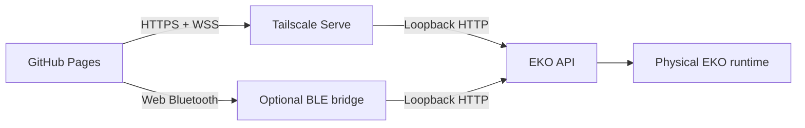

# EKO Remote v1.2.0 architecture

EKO Remote is an operator interface. The Raspberry Pi remains authoritative for AI, memory,
hardware state, camera capture, motion safety, configuration, and logs.

## Topology



The static Pages bundle is public, but the API stays private on `127.0.0.1`. Tailscale Serve
provides trusted private HTTPS/WSS. BLE is a lower-bandwidth fallback.

## Source map

| Path | Responsibility |
| --- | --- |
| `src/types.ts` | Typed status, logs, hardware, workflow, config, and transport contracts |
| `src/client.ts` | Transport-independent semantic operations |
| `src/transports/WifiTransport.ts` | HTTPS routes and WSS telemetry |
| `src/transports/BleTransport.ts` | GATT request framing and disconnect safety |
| `src/hooks/useEkoConnection.ts` | Link lifecycle, polling fallback, status, events, and log buffer |
| `src/components/Shell.tsx` | Navigation, stop, connection controls, and Debug Mode switch |
| `src/components/DebugDock.tsx` | Live structured-log right rail |
| `src/components/EyeDock.tsx` | Dual 128x64 live eye previews |
| `src/pages/DrivePage.tsx` | Manual/gamepad vector input and motor gate |
| `src/pages/VisionPage.tsx` | Physical snapshots, face IDs, and follow availability |
| `src/pages/MapPage.tsx` | Optical-mouse and MPU dead-reckoning view |
| `src/pages/ConfigPage.tsx` | Typed staged configuration and atomic apply |
| `bridge/eko_ble_bridge.py` | BLE notifications, request dispatch, and incremental logs |
| `.github/workflows/deploy-pages.yml` | Test, build, and Pages deployment |

## Request flow

```mermaid
sequenceDiagram
    participant Page
    participant Client as EkoClient
    participant Link as Wi-Fi or BLE
    participant Pi as EKO API
    Page->>Client: Semantic operation
    Client->>Link: Typed request
    Link->>Pi: HTTPS or BLE-to-loopback
    Pi-->>Link: Authoritative result
    Link-->>Page: Typed response
```

UI code does not reproduce categorization, motor planning, face recognition, memory policy, or
hardware decisions. Those remain Pi-side.

## Debug Mode

The top-bar switch changes only the right rail. It does not alter robot behavior or hardware.

The Pi stores a bounded sequence of structured records:

```json
{
  "sequence": 481,
  "timestamp": "2026-07-23T08:30:21.123+00:00",
  "level": "DEBUG",
  "logger": "eko",
  "thread": "eko-tts-output",
  "message": "workflow.output speech completed",
  "exception": null
}
```

Wi-Fi receives records in `/ws` telemetry and catches up with
`GET /debug/logs?after=<sequence>&limit=<count>`. The BLE bridge polls the same endpoint and appends
log deltas to GATT notifications. `useEkoConnection` deduplicates by sequence and retains a bounded
browser buffer.

Pause freezes the visible cutoff while collection continues. Resume reveals the retained records.
Clear removes the local view only; it does not erase the Pi log file.

## Physical UI contract

There is no Mock Mode in v1.2.0:

- Vision requests `/vision/snapshot` from the Pi camera.
- Voice state comes from the Pi microphone loop.
- Speaker and Spotify state come from Pi output services.
- Eyes mirror the Pi-authored expression and gaze state.
- House Map renders Pi-fused optical-mouse translation and Nano MPU yaw.
- Drive sends only when both the physical hardware and motor-specific gates are true.
- Person follow can detect a target, but cannot move while motors are locked.

## Gamepad safety

Drive polls `navigator.getGamepads()` while mounted. Axis 0 and inverted axis 1 provide translation;
buttons 4 and 5 provide rotation. Other axes are ignored. Active vectors are repeated more quickly
than the Pi dead-man timeout. Release, blur, visibility loss, controller disconnect, link loss, and
component unmount attempt an immediate stop.

The on-screen robot is a controller-vector preview while motor drivers are absent. It is not
evidence that GPIO output occurred.

## Atomic configuration

The Config page receives a fixed typed schema without raw YAML or expanded secrets.

1. The browser submits changed fields with `dry_run=true`.
2. The Pi validates the complete cross-file candidate without writing.
3. The browser submits the same batch for apply.
4. The Pi replaces files transactionally and rolls back on failure.
5. Startup-managed changes receive one restart notice.

Motor output requires the Pi-side motor enable and safety acknowledgement. The v1 migration resets
both gates off.

## Security boundaries

- API bearer token for HTTPS/WSS
- Separate optional BLE application token
- Exact Origin allowlist for browser access
- Tailscale identity policy for the optional terminal
- No credential in the Pages build
- Write-only Wi-Fi passwords
- No face descriptors returned to the browser
- Emergency stop accepted even if a BLE application token is wrong
- Debug output treated as potentially sensitive operator data
